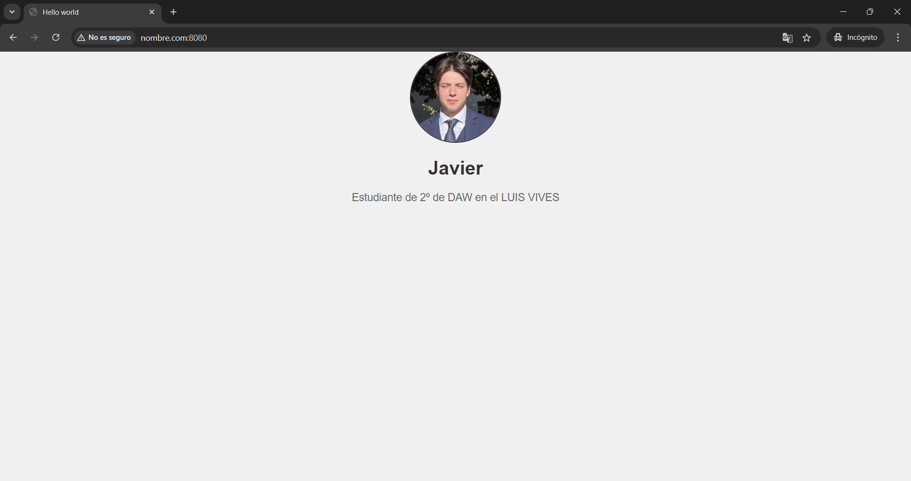

# Práctica despliegue Apache con SSL
## Introducción
Para esta práctica queremos crear un servidor web de apache alojado en un contenedor de docker el cual trabaje con tres dominos. Cada dominio hará referencia a un localHost. Tendremos uno para nuestro nombre, otro para nuestro apellido y finalmente uno que sea seguro y trabaje con https y tenga una sección privada que trabaje con usuario y contraseña.

## Creación del primer dominio
Para desplegar los diferentes servidores haremos uso de un archivo docker-compose el cual nos ayudará ha realizar la configuración del servidor.

Está sería la configuración del primer fragmento del docker-compose.
### hernandez_web
Debajo de services tenemos el nombre del servicio que es hernandez_web.
### Image and Container_name
La imagen de apache que usaremos (ubuntu/apache2), el nombre del contenedor.
### Ports
 los puertos que estamos mapeando, en este caso el 80 de nuestra máquina al puerto 80 que es el de Apache.
### Volumes
 * **./hernandez_website/website:/var/www/html:** El contenido de la carpeta local hernandez_website/website en el host se montará en **/var/www/html** dentro del contenedor, que es la ubicación predeterminada donde Apache sirve los archivos HTML.
* **./hernandez_website/sites-available:/etc/apache2/sites-available:** La carpeta sites-available local se montará en el directorio donde Apache almacena las configuraciones de sitios disponibles en el contenedor.

* **./hernandez_website/scripts:/scripts:** Los scripts locales en hernandez_website/scripts estarán disponibles dentro del contenedor en el directorio **/scripts**.

### Sites-available
En mi directorio sites-available tengo un fichero de configuración que crea un VirtualHost.

Primero le indico que puede ser cualquier puerto pero que lo redireccione al 80 ya que es el de Apache. A continuación le indico la ruta donde va a estar el html que he mapeado anteriormente (/var/www/html). Luego le indico el nombre del dominio que es **www.apellidos.com**. Por último le indico la ruta del html del error 404 en caso de que no se encuentre la web.
### Restart
Indica que Docker siempre intentará reiniciar el contenedor si se detiene por cualquier motivo, lo que asegura que el servicio esté siempre en ejecución.

### EntryPoint
Define el script que se ejecutará como el comando principal cuando el contenedor se inicie. En este caso, el script **HernandezScripts.sh** ubicado en **/scripts** se ejecutará cuando se inicie el contenedor. El uso de entrypoint es para que el contenedor realice tareas adicionales (como configuraciones específicas) al iniciar, antes de ejecutar Apache.

Este es el script que quiero que se ejecute. Lo primero que hace es el **a2ensite apellidos.conf**, esto habilita el archivo de configuración que hemos creado para que sea utilizado por Apache. 

A continuación ejecuta el comando **service apache2 reload**, el cual recarga la configuración del servidor Apache sin detener el servicio. 

Por último,
El comando **pache2ctl -D FOREGROUND** se utiliza para iniciar Apache en primer plano (foreground) en lugar de hacerlo como un servicio en segundo plano (background). Esto significa que el proceso de Apache ocupará la consola en la que fue iniciado y no se "desvinculará" del terminal como lo haría normalmente.

### Habilitar nombre de domino en el archivo hosts
Para habilitar el nombre de dominio de nuestro archivo conf necesitamos añadirlo al archvio de windows hots. Para ello necesitamos ir al directorio **C:\Windows\System32\drivers\etc\** y abrir el archivo hots como administrador. Antes de nada se recomienda hacer una copia de seguridad del archivo. Una vez abierto el archivo deberemos dirigirnos a la parte inferior del archivo y escribir **IP nombre.dominio.com**. La ip será la ip de nuestro sistema y el nombre de dominio sera el de nuestro archivo conf, en mi caso **www.apellidos.com**

## Segundo dominio 
Este segundo dominio funciona de la misma manera, lo único que cambia es que en vez de ser mis apellidos será mi nombre.
En este caso el dominio es **nombre.com** y el puerto sera el **8080**.

## Dominio con ssl
Como en los anteriores dominios empezaremos explicando el docker-compose. 
Al igual que en los anteriores usaremos la imagen de **ubuntu/apache2**. 
### Puertos
En este caso mapearemos el puerto 6969 de nuestra máquina al puerto 80 de Apache. Además, deberemos configurar el puerto de ssl, en este caso el 443 con el 433 de ssl.

### Volumes
* **./javiHernandez_website/website:/var/www/html** Mapea el directorio local ./javiHernandez_website/website a /var/www/html dentro del contenedor para ser servido por Apache.

* **./javiHernandez_website/sites-available:/etc/apache2/sites-available**  Los archivos de configuración de sitios de Apache en tu máquina local estarán disponibles en el contenedor, permitiendo configurar distintos dominios virtuales (virtual hosts) en Apache.

* **./javiHernandez_website/scripts:/scripts** Ejecutara los scripts personalizados en el directorio scripts.

* **./javiHernandez_website/htpasswd/.htpasswd:/etc/apache2/.htpasswd**  El archivo .htpasswd contiene las credenciales de usuarios para la autenticación HTTP básica en Apache. Esto permite proteger directorios con usuario y contraseña.

* **./javiHernandez_website/certs:/etc/apache2/certs** Los certificados SSL locales se compartirán con Apache dentro del contenedor, de manera que se puedan usar para habilitar conexiones seguras SSL/TLS.

### htpasswd
Para crear un usuario y contraseña con el que poder acceder a nuestro dominio de una forma segura, deberemos de crear un directorio **htpasswd** que contenga un archivo **.htpasswd**. Dentro de este archivo deberemos escribir el nombre de usuario : y la contraseña cifrada. En este caso el usuario es **javier:Hernandez**. Para el cifrado de contraseña he usado [Bcrypt](https://bcrypt-generator.com).

### Sites-available
En este caso hemos creado un archivo de configuración el cual tiene dos virtual host, uno para el dominio y otro que lo redirecciona con SSL.

El primer virtual host crea el nombre de dominio el cual es **www.javierHernandez.net** el cual se encuentra en el puerto **6969:80** y lo redirecciona al virtualHost con SSL.

El siguiente virtualHost indica la ruta del html que es donde lo hemos mapeado en el Apache (/var/www/html/). A continuación volvemos a crear el nombre de dominio y mapeamos las páginas de errores que tenemos personalizadas. Las mapeamos con **ErrorDocument número** **/erroNumero.html** ya que ahí es donde se encuentran dichas páginas. Por lo que cada vez que ocurra cualquier de los errores listados estas páginas saldrán en vez de las preconfiguradas del navegador.

Siguiendo con la configuración del SSL, empezamos activando el SSL con **SSLEngine On**. 
* **SSLCertificateFile /etc/apache2/certs/javiSeguros.crt** indica la ruta donde se va a guardar el archivo del certificado SSL que crearemos a continuación.
* **SSLCertificateKeyFile /etc/apache2/certs/javiSeguros.key** indica la ruta donde se guardará la key que generaremos a continuación con el certificado.
* **SSLProtocol All -SSLv3** Habilita los protocolos seguros de SSL.

Luego seguiremos con la configuración de la protección del directorio. En este caso queremos proteger todo el directorio entero por eso le indicamos la ruta **/var/www/html**
* **AuthType Basic** establece una autenticación básica. Esto significa que el servidor solicitará al usuario un nombre de usuario y una contraseña que se enviarán en texto base64 (no cifrado). Para asegurar que esta autenticación sea segura, debe estar acompañada de SSL/TLS (HTTPS), que cifra la transmisión.

* **AuthName "Acceso Restringido a Usuarios"** este es el mensaje que aparecerá en el cuadro para introducir las credenciales.
* **AuthUserFile /etc/apache2/.htpasswd** especifíca la ubicación del archivo **.htpasswd**.
* **Require valid-user** esto indica que cualquier usuario listado en el archivo .htpasswd que proporcione las credenciales válidas tendrá acceso al directorio protegido.
* **Options -Indexes** sta directiva deshabilita el listado de directorios. Si el contenido del directorio no incluye un archivo index.html o index.php (o el archivo definido como índice en la configuración de Apache), el servidor no mostrará una lista de archivos del directorio. En su lugar, devolverá un error 403 ("Prohibido"), lo que impide a los usuarios ver el contenido de esa carpeta.

### Creación de certificado y key
Para crear un certificado SSL y la key que indicamos en el archivo de configuración, hemos usado [OpenSSL](https://slproweb.com/products/Win32OpenSSL.html). Usando su terminal una vez nos colocamos en la ruta donde van a ir los certificados ejecutamos el siguiente comando.

    openssl req -x509 -nodes -days 365 -newkey rsa:2048 -keyout javiSeguros.key -out javiSeguros.crt
Una vez ejecutado el domino nos hará documentar el Pais, cuidad, nombre de la empresa, correo...
Una vez creado el certificado y la key estaría todo listo.

## Ejecución
Para levantar los contenedores y Apache pueda trabajar deberemos usar el comando **docker-compose up -d**.

Para entrar a la web de mis apellidos debremos buscar por **www.apellidos.com**. 

Para entrar a la web de mi nombre deberemos de buscar por **nombre.com:8080**, hay que buscar por el puerto ya que si no cogerá el por defecto que es el 80. 

Para entrar a la web protegida con usuario y contraseña deberemos buscar por **www.javierHernandez.net:6969**.

Al buscar esta web nos saldrá un aviso de que no es un sitio seguro, esto es debido a que el certificado es uno no oficial y no esta verificado por una entidad de certificados oficiales. Por lo que deberemos clickar en configuración avanzada y entrar al sitio web.

A continuación metemos los credenciales válidos del archivo **.htpasswd** en este caso **javier:Hernandez**.

